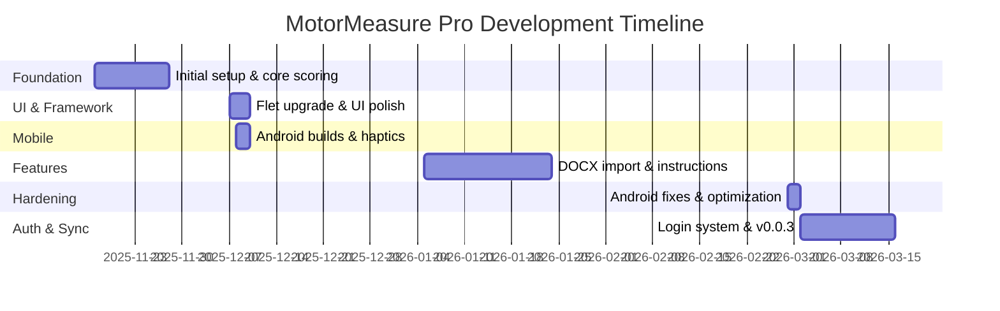
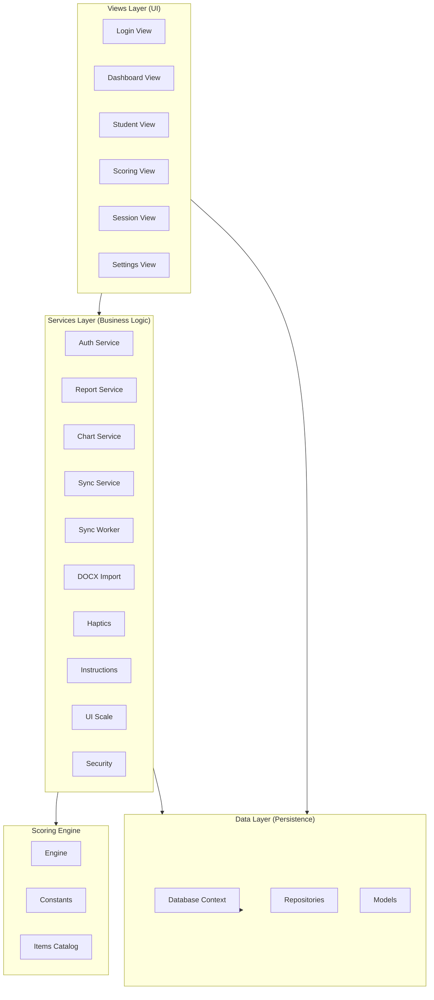
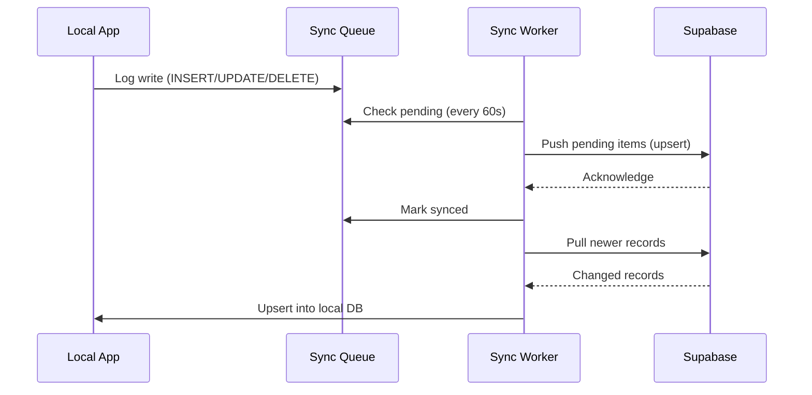

# MotorMeasure Pro — Development Journey & Architecture Document

> **Project**: GMFM_System88 / MotorMeasure Pro  
> **Period**: November 2025 – March 2026  
> **Author**: Uttkarsh Singh  
> **Codebase**: ~34 source files, ~1.4 MB of code (including embedded assets)

---

## 1. What Is This Project?

**MotorMeasure Pro** is a **cross-platform clinical assessment application** that digitizes the **Gross Motor Function Measure (GMFM-88)** scoring process. The GMFM is a standardized tool used by physiotherapists and clinicians to measure gross motor function in children with cerebral palsy and other motor disabilities.

The app replaces paper-based scoresheets with a mobile-first digital workflow, enabling clinicians to:
- **Score all 88 items** across 5 motor domains (0–3 scale + Not Tested)
- **Manage student/patient profiles** with encrypted personal data
- **Track progress over time** with session history and trend charts
- **Generate PDF reports** that match the official GMFM scoresheet format
- **Sync data to the cloud** via Supabase for backup and multi-device access

---

## 2. Technology Stack

| Layer | Technology | Purpose |
|-------|-----------|---------|
| **Language** | Python 3.11+ | Core runtime |
| **UI Framework** | Flet 0.28.3 | Cross-platform UI (Flutter-based, renders natively) |
| **Local Database** | SQLite (via `sqlite3`) | Offline-first persistence |
| **Cloud Backend** | Supabase (PostgreSQL + Auth) | Cloud sync, user authentication |
| **PDF Generation** | fpdf2 (primary), ReportLab (desktop), Raw PDF (fallback) | Clinical report generation |
| **Charts** | Matplotlib (optional) | Trend visualization |
| **Data Validation** | Pydantic (with dataclass fallback) | Model validation |
| **Encryption** | `cryptography` (Fernet) | Field-level encryption at rest |
| **Password Hashing** | PBKDF2-SHA256 (200k iterations) | Secure local authentication |
| **DOCX Import** | python-docx | Import existing assessments |
| **Build Target** | Flet CLI (`flet build apk/ipa`) | Android APK / iOS builds |

### Key Design Decision: Triple PDF Fallback

The report service implements a **3-tier fallback** for PDF generation:
1. **ReportLab** — Full-featured (desktop, needs C extensions)
2. **fpdf2** — Pure Python (works on Android)
3. **Raw PDF** — Zero dependencies, hand-crafted PDF byte stream (~300 lines of raw PDF operators)

This ensures reports work on *every* platform, even when no PDF library is available.

---

## 3. Git Commit History & Development Timeline

```
23 commits over ~4 months by Uttkarsh Singh
```

| # | Date | Commit | Message | Phase |
|---|------|--------|---------|-------|
| 1 | 2025-11-17 | `375251d` | Initial commit | 🏗️ Foundation |
| 2 | 2025-11-22 | `edeff63` | some_updates | 🏗️ Foundation |
| 3 | 2025-11-22 | `2f050de` | ui_changes | 🎨 UI |
| 4 | 2025-11-28 | `6da6253` | some_changes | 🔧 Iteration |
| 5 | 2025-12-07 | `b3be147` | new flet | 🔄 Framework Upgrade |
| 6 | 2025-12-07 | `48f6984` | changes | 🔧 Iteration |
| 7 | 2025-12-08 | `061acaa` | ui_improvements | 🎨 UI Polish |
| 8 | 2025-12-08 | `fbc7656` | del | 🧹 Cleanup |
| 9 | 2025-12-08 | `d0535d7` | ando | 📱 Android |
| 10 | 2025-12-09 | `0d8e6c3` | needs to be fixed | 🐛 Bug Fix |
| 11 | 2025-12-10 | `8763df8` | haptics | 📳 Haptic Feedback |
| 12 | 2026-01-05 | `8a530c2` | changes_to_add_DOCX | 📄 DOCX Import |
| 13 | 2026-01-12 | `0a97b29` | changes | 🔧 Iteration |
| 14 | 2026-01-12 | `a576dd5` | ignores | 🧹 Git Config |
| 15 | 2026-01-24 | `3b42538` | Update instructions_data.json | 📋 Content |
| 16 | 2026-02-28 | `6123f95` | uodate_yeah | 🔧 Update |
| 17 | 2026-03-02 | `0e16d4b` | android_fixed | 📱 Android Fix |
| 18 | 2026-03-02 | `9544430` | android_fixed | 📱 Android Fix |
| 19 | 2026-03-02 | `71e6877` | optimised | ⚡ Optimization |
| 20 | 2026-03-02 | `dcb9b47` | final? | 🏁 Stabilization |
| 21 | 2026-03-02 | `cfeed0e` | logo_added | 🎨 Branding |
| 22 | 2026-03-02 | `942e0c8` | things_done | 🏁 Stabilization |
| 23 | 2026-03-16 | `483cd11` | 0.0.3, login | 🔐 Auth System |

### Development Phases



---

## 4. Architecture Overview

### Layered Architecture



### Module Breakdown

#### 📁 `src/gmfm_app/main.py` — Application Entry Point (600 lines)
- **GMFMApp class** — Core app controller with views-based routing
- **Splash screen** — Animated logo sequence with fade transitions
- **Platform detection** — Auto-detects Android/iOS vs desktop
- **Theme management** — Dark/Light mode with persistence
- **Route management** — Custom URL-based navigation with history stack
- **Navigation locking** — Prevents concurrent nav (fixes blank-screen bugs)
- **Background DB init** — Database loads in a separate thread during splash

#### 📁 `src/gmfm_app/data/` — Data Layer

| File | Lines | Purpose |
|------|-------|---------|
| [database.py](file:///d:/PROGRAM/COMPRO/GMFM/GMFM_System88/src/gmfm_app/data/database.py) | 220 | SQLite connection factory, 8 schema migrations, multi-platform path resolution |
| [models.py](file:///d:/PROGRAM/COMPRO/GMFM/GMFM_System88/src/gmfm_app/data/models.py) | 107 | `Student`, `Session`, `AppUser` — Pydantic with dataclass fallback |
| [repositories.py](file:///d:/PROGRAM/COMPRO/GMFM/GMFM_System88/src/gmfm_app/data/repositories.py) | 370 | CRUD operations with per-user data isolation, sync queue logging |

**Key patterns:**
- **Dual model system** — Uses Pydantic if available, falls back to dataclasses (for Android compatibility)
- **Per-user data isolation** — All queries filter by `user_id` when available
- **Sync queue** — Every write operation logs to `sync_queue` table for offline-first cloud sync
- **Encrypted fields** — Patient names and identifiers encrypted using Fernet before storage

#### 📁 `src/gmfm_app/scoring/` — GMFM-88 Scoring Engine

| File | Lines | Purpose |
|------|-------|---------|
| [engine.py](file:///d:/PROGRAM/COMPRO/GMFM/GMFM_System88/src/gmfm_app/scoring/engine.py) | 77 | Domain percentage calculation, total score computation |
| [constants.py](file:///d:/PROGRAM/COMPRO/GMFM/GMFM_System88/src/gmfm_app/scoring/constants.py) | 55 | Lazy-loaded `_LazyItems` class for GMFM-88 item mappings |
| [items_catalog.py](file:///d:/PROGRAM/COMPRO/GMFM/GMFM_System88/src/gmfm_app/scoring/items_catalog.py) | ~100 | Item number → domain mapping builder, domain metadata |
| [items_data.json](file:///d:/PROGRAM/COMPRO/GMFM/GMFM_System88/src/gmfm_app/scoring/items_data.json) | — | All 88 GMFM items with numbers, descriptions, and domains |

**Scoring algorithm:**
- Maps 88 items across 5 domains: A (Lying & Rolling), B (Sitting), C (Crawling & Kneeling), D (Standing), E (Walking & Running)
- Each item scored 0–3 or NT (Not Tested)
- Per-domain percentage = (sum of scored items) ÷ (count × 3) × 100
- Total percentage = weighted average across all domains

#### 📁 `src/gmfm_app/services/` — Business Logic Layer

| File | Lines | Purpose |
|------|-------|---------|
| [auth_service.py](file:///d:/PROGRAM/COMPRO/GMFM/GMFM_System88/src/gmfm_app/services/auth_service.py) | 179 | Local auth (PBKDF2-SHA256) + auto cloud login via Supabase |
| [sync_service.py](file:///d:/PROGRAM/COMPRO/GMFM/GMFM_System88/src/gmfm_app/services/sync_service.py) | 402 | Offline-first sync engine: push/pull/sync with Supabase |
| [sync_worker.py](file:///d:/PROGRAM/COMPRO/GMFM/GMFM_System88/src/gmfm_app/services/sync_worker.py) | 85 | Background thread auto-syncing every 60s |
| [sync_config.py](file:///d:/PROGRAM/COMPRO/GMFM/GMFM_System88/src/gmfm_app/services/sync_config.py) | 60 | Supabase connection config, stored in Flet client_storage |
| [report_service.py](file:///d:/PROGRAM/COMPRO/GMFM/GMFM_System88/src/gmfm_app/services/report_service.py) | 644 | Triple PDF fallback (ReportLab → fpdf2 → raw PDF) |
| [chart_service.py](file:///d:/PROGRAM/COMPRO/GMFM/GMFM_System88/src/gmfm_app/services/chart_service.py) | 94 | Matplotlib trend charts (total + per-domain) |
| [docx_import_service.py](file:///d:/PROGRAM/COMPRO/GMFM/GMFM_System88/src/gmfm_app/services/docx_import_service.py) | 324 | Parse GMFM DOCX files, extract multi-session assessments |
| [security.py](file:///d:/PROGRAM/COMPRO/GMFM/GMFM_System88/src/gmfm_app/services/security.py) | 92 | Fernet encryption, key resolution (env → file → generate) |
| [haptics.py](file:///d:/PROGRAM/COMPRO/GMFM/GMFM_System88/src/gmfm_app/services/haptics.py) | 82 | Haptic feedback patterns (optimized for Nothing Phone 2a) |
| [instructions_service.py](file:///d:/PROGRAM/COMPRO/GMFM/GMFM_System88/src/gmfm_app/services/instructions_service.py) | 100 | Load exercise instructions from JSON (multi-path Android compat) |
| [ui_scale.py](file:///d:/PROGRAM/COMPRO/GMFM/GMFM_System88/src/gmfm_app/services/ui_scale.py) | 125 | Android accessibility scaling (reads system text_scale_factor) |
| [instructions_data.json](file:///d:/PROGRAM/COMPRO/GMFM/GMFM_System88/src/gmfm_app/services/instructions_data.json) | — | 80 KB of exercise instructions (scoring criteria, descriptions) |

#### 📁 `src/gmfm_app/views/` — UI Layer

| File | Lines | Purpose |
|------|-------|---------|
| [login_view.py](file:///d:/PROGRAM/COMPRO/GMFM/GMFM_System88/src/gmfm_app/views/login_view.py) | ~370 | Login + registration, first admin setup, form validation |
| [dashboard_view.py](file:///d:/PROGRAM/COMPRO/GMFM/GMFM_System88/src/gmfm_app/views/dashboard_view.py) | ~640 | Student cards, stats, recent sessions, search, quick actions |
| [student_view.py](file:///d:/PROGRAM/COMPRO/GMFM/GMFM_System88/src/gmfm_app/views/student_view.py) | ~250 | Add/edit student profiles (name, DOB, identifier) |
| [scoring_view.py](file:///d:/PROGRAM/COMPRO/GMFM/GMFM_System88/src/gmfm_app/views/scoring_view.py) | ~690 | Scoring interface — all 88 items across 5 domains with in-app instructions |
| [session_view.py](file:///d:/PROGRAM/COMPRO/GMFM/GMFM_System88/src/gmfm_app/views/session_view.py) | ~760 | Session history, detail view, session comparison |
| [settings_view.py](file:///d:/PROGRAM/COMPRO/GMFM/GMFM_System88/src/gmfm_app/views/settings_view.py) | ~645 | Cloud sync config, theme toggle, DOCX import, data management |

---

## 5. Database Schema

### Local SQLite Schema

```sql
-- Core tables
students (id, given_name*, family_name*, dob, identifier*, created_at, user_id)
sessions (id, student_id, scale, raw_scores, total_score, notes, created_at, user_id)
app_users (id, username, password_hash, full_name, role, is_active, email, created_at)
settings (key, value)

-- Sync infrastructure
sync_queue (id, table_name, record_id, operation, payload, created_at, synced)
sync_metadata (key, value)

-- * = Fernet-encrypted at rest
```

### Cloud Schema (Supabase PostgreSQL)

```sql
students (id, user_id, local_id, given_name, family_name, dob, identifier, deleted, ...)
sessions (id, user_id, local_id, student_local_id, scale, raw_scores, total_score, ...)
sync_metadata (id, user_id, key, value)

-- Row Level Security: each user can only see their own data
-- Indexes on user_id for performance
```

### Schema Migrations

The app handles 8 in-code migrations:
1. Rename `patients` → `students` table
2. Add `notes` column to sessions
3. Add `role` and `is_active` to app_users
4. Rename `patient_id` → `student_id` in sessions
5. Add `email` column to app_users
6. Add `user_id` to students (data isolation)
7. Add `user_id` to sessions (data isolation)
8. Create `sync_queue` and `sync_metadata` tables

---

## 6. Key Feature Deep-Dives

### 🔄 Offline-First Cloud Sync

The sync system follows a **git-like model**:



- **Local wins**: Pending local changes skip cloud pull for same record
- **Soft deletes**: Cloud uses `deleted` flag instead of hard delete
- **Auto-retry**: Background worker retries every 60 seconds
- **Connectivity check**: Pings `8.8.8.8:53` before attempting sync

### 🔐 Authentication System

Two-tier authentication:
1. **Local**: PBKDF2-SHA256 with 200,000 iterations, 16-byte random salt
2. **Cloud**: Auto-registers/logs-in to Supabase Auth when email provided

Session is stored in Flet's `client_storage` (persists across app restarts). All routes except `/login` are protected.

### 📄 PDF Report Generation

Generates clinical-grade GMFM scoresheets with:
- Student information header
- Total score banner (teal branded)
- Domain summary table (5 domains + totals)
- Detailed item-by-item score tables (88 items with 0/1/2/3/NT marks)
- Notes section
- Optional trend chart embedding

The **raw PDF fallback** (~300 lines) hand-crafts the PDF binary format including:
- Custom `_PdfPage` class with graphics/text streams
- Bordered table cells with fill colors
- Multi-page support with automatic page breaks
- Proper xref table and trailer construction

### 📱 Android Compatibility Layer

Special handling for mobile deployment:
- `FLET_APP_STORAGE_DATA` env var for private storage paths
- Embedded base64 splash assets (logos in [splash_assets.py](file:///d:/PROGRAM/COMPRO/GMFM/GMFM_System88/src/gmfm_app/splash_assets.py) — 1 MB)
- Lazy imports to avoid crashing when libraries aren't available
- Multi-path file resolution for JSON data files
- Android accessibility scaling (reads `text_scale_factor`)
- Haptic feedback optimized for Nothing Phone 2a's linear motor

---

## 7. Development Journey Narrative

### Phase 1: Foundation (Nov 17–28, 2025)

The project started with the **Initial commit** on November 17, 2025. The early architecture document references **KivyMD** as the UI toolkit, indicating the app was originally designed with Kivy before being ported to Flet. The initial setup included:
- Core database schema (patients → later renamed to students)
- Basic GMFM-88 scoring engine
- Pydantic models for data validation
- SQLite persistence layer

Two follow-up commits in late November refined the UI and added foundational changes.

### Phase 2: Framework Migration & UI Polish (Dec 7–10, 2025)

A critical pivot occurred in early December: the commit **"new flet"** (`b3be147`) signals the **migration from KivyMD to Flet**. This was likely driven by Flet's superior cross-platform capabilities and easier Android deployment. Over 3 intense days:
- UI was rebuilt with Flet components
- Android builds were attempted (commit `d0535d7`: "ando")
- Issues emerged ("needs to be fixed")
- **Haptic feedback** was added, specifically optimized for the Nothing Phone 2a
- UI cleanup and improvements were made across multiple commits

### Phase 3: Feature Expansion (Jan 5 – Jan 24, 2026)

After a holiday break, January brought significant feature additions:
- **DOCX Import Service** — Parse existing GMFM assessment documents (supporting multi-session files with multiple date headers)
- **Exercise Instructions** — 80 KB JSON database of all 88 exercise descriptions, scoring criteria, starting positions, and instructions
- **.gitignore refinements** to keep the repository clean

### Phase 4: Stabilization & Android Fixes (Feb 28 – Mar 2, 2026)

A major push in late February / early March focused on making the Android build reliable:
- Multiple **Android-specific fixes** (path resolution, import errors, asset loading)
- **Performance optimization** pass
- **Logo and branding** integration (base64-embedded splash assets)
- Multiple commits in a single day (Mar 2: 6 commits) showing rapid iteration and testing

### Phase 5: Authentication & Cloud Sync (Mar 2–16, 2026)

The final phase added enterprise-grade features:
- **Local authentication** with secure password hashing (PBKDF2-SHA256)
- **User registration and login** views
- **Per-user data isolation** — each user only sees their own students/sessions
- **Supabase cloud backend** integration with Row Level Security
- **Offline-first sync engine** following a git-like push/pull model
- **Background sync worker** running on a 60-second interval
- Version tagged as **v0.0.3**

---

## 8. File & Code Statistics

| Metric | Value |
|--------|-------|
| Total source files (`.py` + `.json`) | 34 |
| Total source code size | ~1.4 MB |
| Largest file | `splash_assets.py` (~1 MB, base64 logos) |
| Total `.py` lines (excluding assets) | ~5,500+ |
| Git commits | 23 |
| Development period | 4 months |
| Views | 6 |
| Services | 12 |
| Database tables | 6 |
| Schema migrations | 8 |
| GMFM items scored | 88 |
| Motor domains | 5 |

---

## 9. Project Files at a Glance

```
GMFM_System88/
├── src/
│   ├── main.py                          # Outer entry point
│   ├── entry_point.py                   # Android entry point
│   ├── requirements.txt                 # flet, fpdf2, supabase
│   └── gmfm_app/
│       ├── main.py                      # App bootstrap (600 lines)
│       ├── main_desktop.py              # Desktop-specific launcher
│       ├── splash_assets.py             # Base64-encoded logos (~1 MB)
│       ├── data/
│       │   ├── database.py              # SQLite + migrations
│       │   ├── models.py                # Pydantic/dataclass models
│       │   └── repositories.py          # CRUD + sync queue
│       ├── scoring/
│       │   ├── engine.py                # GMFM-88 scoring algorithm
│       │   ├── constants.py             # Lazy-loaded item mappings
│       │   ├── items_catalog.py         # Domain/item builder
│       │   └── items_data.json          # All 88 items catalog
│       ├── services/
│       │   ├── auth_service.py          # PBKDF2 local auth + cloud
│       │   ├── sync_service.py          # Push/pull sync engine
│       │   ├── sync_worker.py           # Background auto-sync
│       │   ├── sync_config.py           # Supabase config management
│       │   ├── report_service.py        # 3-tier PDF generation
│       │   ├── chart_service.py         # Matplotlib trend charts
│       │   ├── docx_import_service.py   # DOCX assessment parser
│       │   ├── security.py              # Fernet encryption provider
│       │   ├── haptics.py               # Mobile haptic feedback
│       │   ├── instructions_service.py  # Exercise instructions loader
│       │   ├── instructions_data.json   # 88 exercise descriptions
│       │   └── ui_scale.py              # Android accessibility scale
│       └── views/
│           ├── login_view.py            # Auth UI
│           ├── dashboard_view.py        # Main dashboard
│           ├── student_view.py          # Student profile form
│           ├── scoring_view.py          # GMFM scoring interface
│           ├── session_view.py          # History + detail + compare
│           └── settings_view.py         # Settings + sync + import
├── docs/
│   ├── architecture.md                  # Architecture documentation
│   └── gmfm_scoresheet.txt              # Reference scoresheet
├── tests/
│   ├── test_scoring.py                  # Scoring engine tests
│   └── test_docx_import_verify.py       # DOCX parser tests
├── supabase_schema.sql                  # Cloud database schema + RLS
├── README.md                            # Project documentation
├── GMFCS.docx                           # Reference GMFCS document
├── gmfm-88_and_66_scoresheet.pdf        # Official GMFM scoresheet
├── architecture_diagram.png             # Architecture diagram
├── workflow_diagram.png                 # Workflow diagram
├── problem_diagram.png                  # Problem statement diagram
├── GMFM_Presentation.pptx              # Project presentations
├── GMFM_Pro_Presentation.pptx
└── MotorMeasure_Pro_Presentation.pptx
```

---

## 10. Roadmap (from README)

- [ ] Remote sync adapter for multi-device support
- [ ] Role-based access control for clinical teams
- [ ] GMFCS classification integration
- [ ] Automated deployment packages
- [ ] GMFM-66 scale-specific calculations (item difficulty lookup tables)
- [ ] CLI export tool (`python -m gmfm_app.cli export`)
